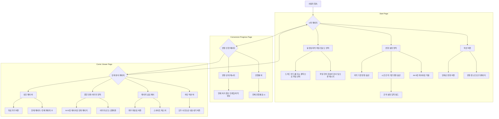

```mermaid
graph TD
    A[사용자 접속] --> B{시작 페이지}

    subgraph "Start Page"
        B --> B1[동영상/자막 파일 업로드 영역]
        B1 --> B1_1[드래그 앤 드롭 또는 클릭으로 파일 선택]
        B1 --> B1_2[파일 형식 유효성 검사 및 오류 메시지]

        B --> B2[변환 설정 영역]
        B2 --> B2_1[자막 기준 변환 옵션]
        B2 --> B2_2[시간 간격 기준 변환 옵션]
        B2_2 --> B2_2_1[간격 설정 입력 필드]
        B2 --> B2_3[A4 6컷 레이아웃 적용]

        B --> B3[액션 버튼]
        B3 --> B3_1[만화로 변환 버튼]
        B3 --> B3_2[변환 중 로딩 인디케이터]
    end

    B --> C{변환 진행 페이지}

    subgraph "Conversion Progress Page"
        C --> C1[변환 상태 메시지]
        C1 --> C1_1[현재 처리 중인 프레임/자막 정보]
        C --> C2[진행률 바]
        C2 --> C2_1[전체 진행률 표시]
    end

    C --> D{만화 뷰어 페이지}

    subgraph "Comic Viewer Page"
        D --> D1[상단 제어 바]
        D1 --> D1_1[뒤로가기 버튼]
        D1 --> D1_2[현재 페이지 / 전체 페이지 수]

        D --> D2[중앙 만화 이미지 영역]
        D2 --> D2_1[A4 6컷 레이아웃 만화 페이지]
        D2 --> D2_2[이미지 로딩 스켈레톤]

        D --> D3[페이지 넘김 제어]
        D3 --> D3_1[좌우 화살표 버튼]
        D3 --> D3_2[스와이프 제스처]

        D --> D4[하단 액션 바]
        D4 --> D4_1[모두 사진으로 내보내기 버튼]
    end

    D --> B
```
