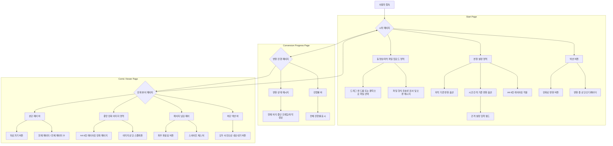

# FrameFlow 프로젝트 설계 문서

이 문서는 "FrameFlow" 웹 애플리케이션의 개발을 위한 전반적인 설계 및 계획을 담고 있습니다. 사용자가 동영상을 만화 형태로 변환하고 감상할 수 있도록 돕는 웹앱 개발을 목표로 합니다.

## 1. 프로젝트 개요

- **프로젝트 이름:** FrameFlow
    
- **프로젝트 목표:** 사용자가 동영상을 업로드하고, 자막 또는 특정 시간 간격을 기준으로 해당 시점의 스크린샷을 추출하여 A4 6컷 만화 레이아웃으로 변환하고 감상하며, 모든 이미지를 내보낼 수 있는 반응형 웹앱을 개발합니다. 웹앱은 PWA(Progressive Web App) 형태로 플레이스토어 배포를 고려합니다.
    
- **핵심 기능:**
    
    - **동영상 및 자막 파일 업로드:** 로컬 기기에서 동영상 및 자막(SRT, VTT) 파일 업로드.
        
    - **스크린샷 추출 설정:** 자막 기준 또는 시간 간격(사용자 지정) 기준 선택.
        
    - **A4 6컷 레이아웃 적용:** 추출된 프레임을 A4 사이즈 캔버스에 6컷으로 배치하여 만화 페이지 생성.
        
    - **만화 뷰어:** 변환된 만화 페이지를 페이지 단위로 감상.
        
    - **모든 사진 내보내기:** 변환된 모든 만화 페이지를 ZIP 또는 PDF 파일로 다운로드.
        
    - **반응형 UI:** 모바일 및 PC 환경에서 최적화된 사용자 경험 제공.
        
    - **PWA 지원:** 모바일 기기에서 앱처럼 설치 및 사용 가능.
        

## 2. 기술 스택

- **프론트엔드 프레임워크:** **React**
    
    - 컴포넌트 기반 개발, 높은 생산성, 방대한 생태계.
        
- **빌드 도구:** **Vite**
    
    - 매우 빠른 개발 서버 및 번들링, 경량.
        
- **언어:** **TypeScript**
    
    - 타입 안정성을 통한 코드 품질 향상 및 유지보수 용이성.
        
- **상태 관리 (선택 사항):** **Zustand 또는 React Context API**
    
    - 프로젝트 규모에 따라 적절히 선택.
        
- **UI/UX 라이브러리 (선택 사항):** **Tailwind CSS 또는 Emotion/Styled Components**
    
    - 빠른 스타일링 및 컴포넌트 기반 스타일링.
        
- **PWA 라이브러리/도구:** **Workbox (Vite 플러그인)**
    
    - Service Worker 생성 및 관리 간소화.
        
- **배포:** **Vercel**
    
    - Git 연동을 통한 자동 배포, 빠른 CDN.
        
- **테스트 러너 및 프레임워크:** **Vitest**
    
    - Vite 기반 프로젝트에 최적화, Jest 유사 API, 빠른 실행.
        
- **테스팅 라이브러리:** **React Testing Library (RTL)**
    
    - 사용자 관점의 컴포넌트 테스트, 리팩토링에 강점.
        
- **모킹 라이브러리:** **`vi.mock` (Vitest 내장) 또는 `msw` (Mock Service Worker)**
    
    - 외부 의존성 격리 및 안정적인 테스트.
        

## 3. 프로젝트 구조

유지보수 용이성을 위해 다음과 같이 파일을 구조화합니다.

```
/
├── public/                 # 정적 파일 (index.html, manifest.json, favicon.ico 등 PWA 관련 파일)
│   ├── manifest.json       # PWA 앱 메타데이터
│   └── service-worker.js   # (Workbox가 생성) 오프라인 지원, 캐싱
├── src/
│   ├── assets/             # 이미지, 폰트 등 정적 리소스
│   ├── components/         # 재사용 가능한 UI 컴포넌트
│   │   ├── Button/
│   │   │   └── Button.tsx
│   │   │   └── Button.module.css
│   │   ├── FileUploader/
│   │   │   └── FileUploader.tsx
│   │   ├── ConversionSettings/
│   │   │   └── ConversionSettings.tsx
│   │   ├── ComicViewer/
│   │   │   └── ComicViewer.tsx
│   │   └── LoadingSpinner/
│   │       └── LoadingSpinner.tsx
│   ├── hooks/              # 커스텀 React Hooks (로직 재사용)
│   │   ├── useVideoProcessor.ts # 비디오 처리 로직
│   │   ├── usePWA.ts       # PWA 관련 로직
│   │   └── useImageExporter.ts # 이미지 내보내기 로직
│   ├── pages/              # 라우팅 되는 페이지 컴포넌트
│   │   ├── HomePage/
│   │   │   └── HomePage.tsx
│   │   │   └── HomePage.module.css
│   │   ├── ConversionPage/
│   │   │   └── ConversionPage.tsx
│   │   ├── ViewerPage/
│   │   │   └── ViewerPage.tsx
│   │   └── NotFoundPage/
│   │       └── NotFoundPage.tsx
│   ├── utils/              # 유틸리티 함수 (자막 파싱, 시간 변환, 캔버스 처리 등)
│   │   ├── subtitleParser.ts
│   │   ├── videoProcessing.ts
│   │   ├── imageLayout.ts # A4 6컷 레이아웃 관련
│   │   └── fileExport.ts  # ZIP/PDF 내보내기 관련
│   ├── styles/             # 전역 스타일, 변수
│   │   └── global.css
│   ├── App.tsx             # 메인 앱 컴포넌트, 라우팅 설정
│   ├── main.tsx            # React 앱 엔트리 포인트
│   └── vite-env.d.ts       # Vite 환경 타입 정의
├── .gitignore              # Git 무시 파일
├── package.json            # 프로젝트 의존성 및 스크립트
├── vite.config.ts          # Vite 설정 파일
├── tsconfig.json           # TypeScript 설정 파일
├── README.md               # 프로젝트 설명
└── vitest.config.ts        # Vitest 설정 파일 (또는 vite.config.ts에 통합)
```

## 4. 테스트 전략 및 설계

### 4.1. 테스트 전략 및 목표

- **목표:**
    
    - **신뢰성 확보:** 핵심 기능(동영상 업로드, 스크린샷 추출, 자막 파싱 등)이 예상대로 작동하는지 검증.
        
    - **유지보수성 향상:** 코드 변경 시 기존 기능에 문제가 없는지 빠르게 확인.
        
    - **버그 조기 발견:** 개발 초기 단계에서 오류를 찾아내어 수정 비용 절감.
        
- **테스트 레벨:**
    
    - **단위 테스트 (Unit Test):** 함수, 순수 컴포넌트 등 가장 작은 코드 단위 테스트.
        
    - **통합 테스트 (Integration Test):** 여러 컴포넌트/모듈이 함께 작동하는 시나리오 테스트.
        
    - **E2E 테스트 (End-to-End Test):** (선택 사항) 사용자 관점에서 전체 워크플로우 테스트.
        

### 4.2. 주요 테스트 도구

- **Vitest:** Vite 기반 프로젝트에 최적화된 빠르고 경량의 테스트 프레임워크.
    
- **React Testing Library (RTL):** 사용자 관점에서 컴포넌트를 테스트하는 데 중점.
    
- **`jsdom`:** Node.js 환경에서 브라우저 DOM을 시뮬레이션.
    
- **`@testing-library/jest-dom`:** RTL과 함께 사용되는 Jest-DOM 매처 확장.
    

### 4.3. 테스트 대상 및 우선순위

1. **유틸리티 함수 (`utils/`) - 높은 우선순위 (단위 테스트)**
    
    - `subtitleParser.ts`: SRT/VTT 파싱 정확성, 오류 처리.
        
    - `videoProcessing.ts`: 시간 변환, 캔버스 프레임 추출 로직 (모킹 필요).
        
    - `imageLayout.ts`: A4 6컷 레이아웃 계산 및 이미지 합성 로직.
        
    - `fileExport.ts`: ZIP/PDF 파일 생성 및 다운로드 로직.
        
2. **커스텀 Hooks (`hooks/`) - 높은 우선순위 (단위/통합 테스트)**
    
    - `useVideoProcessor.ts`: 동영상 업로드, 변환 설정 적용, 프레임 추출 흐름.
        
    - `useImageExporter.ts`: 이미지 내보내기 기능 트리거 및 상태 관리.
        
3. **컴포넌트 (`components/`) - 중간 우선순위 (단위/통합 테스트)**
    
    - `FileUploader`: 파일 선택/드래그앤드롭 이벤트, 유효성 검사 메시지 표시.
        
    - `ConversionSettings`: 라디오 버튼/체크박스 상태 변경, 입력 필드 값 변경.
        
    - `Button`: 클릭 이벤트, 비활성화 상태.
        
    - `ComicViewer`: 이미지 렌더링, 페이지 넘김 상호작용.
        
4. **페이지 (`pages/`) - 낮은/중간 우선순위 (통합 테스트)**
    
    - `HomePage`: 전체 업로드 및 설정 플로우.
        
    - `ViewerPage`: 만화 뷰어의 전체 기능 및 내보내기 통합.
        

### 4.4. 테스트 환경 설정 (Vite + Vitest)

1. **설치:**
    
    ```
    npm install -D vitest @testing-library/react @testing-library/jest-dom jsdom
    ```
    
2. **`vite.config.ts` 설정:**
    
    ```
    import { defineConfig } from 'vite';
    import react from '@vitejs/plugin-react';
    
    export default defineConfig({
      plugins: [react()],
      test: {
        globals: true,
        environment: 'jsdom',
        setupFiles: './src/setupTests.ts',
        css: true,
      },
    });
    ```
    
3. **`src/setupTests.ts` 파일 생성:**
    
    ```
    import '@testing-library/jest-dom';
    ```
    
4. **`package.json` 스크립트 추가:**
    
    ```
    {
      "scripts": {
        "test": "vitest",
        "coverage": "vitest run --coverage"
      }
    }
    ```
    

## 5. 프론트엔드 UI/UX 설계

"FrameFlow" 웹앱의 UI/UX는 **직관성, 사용 편의성, 그리고 반응형 디자인**에 중점을 둡니다.

### 5.1. 전반적인 디자인 원칙

- **미니멀리즘:** 핵심 기능에 집중하여 깔끔한 인터페이스 제공.
    
- **직관적인 흐름:** 명확한 안내와 시각적 피드백으로 사용자 작업 인지 용이.
    
- **일관성:** 모든 페이지와 컴포넌트에서 통일된 디자인 언어 유지.
    
- **반응형:** 모바일 및 데스크톱 환경에서 최적화된 레이아웃 및 상호작용 지원.
    

### 5.2. 주요 페이지 및 레이아웃

#### 5.2.1. 시작 페이지 (Start Page)

앱 접속 시 가장 먼저 보이는 페이지로, 변환 작업을 시작하는 곳입니다.

- **상단 헤더:** 로고/앱 이름 "FrameFlow".
    
- **중앙 콘텐츠 영역:**
    
    - **"파일 업로드" 영역:** 드래그 앤 드롭 또는 클릭으로 동영상 및 자막 파일 선택 가능한 시각적으로 명확한 영역. "동영상을 여기에 끌어다 놓거나 클릭하여 선택하세요."와 같은 안내 문구 표시.
        
    - **파일 형식 유효성 검사 및 오류 메시지:** 업로드 시 유효성 검사 및 오류 발생 시 메시지 표시.
        
    - **변환 설정:**
        
        - **라디오 버튼:** "자막 기준 변환" 또는 "시간 간격 기준 변환" 선택.
            
        - **입력 필드:** "시간 간격 기준" 선택 시 활성화되는 초 단위 간격 설정 필드.
            
        - **체크박스:** "A4 6컷 레이아웃 적용" 옵션.
            
    - **"만화로 변환" 버튼:** 동영상 업로드 및 변환 옵션 선택 시 활성화. 클릭 시 변환 시작 및 로딩 인디케이터 표시.
        
- **반응형 고려사항:**
    
    - **모바일:** 업로드 영역, 설정, 버튼이 세로로 정렬.
        
    - **데스크톱:** 넓은 공간 활용, 요소들을 좌우로 배치.
        

#### 5.2.2. 변환 진행 페이지 (Conversion Progress Page)

동영상을 만화 이미지로 변환하는 동안 진행 상황을 보여주는 페이지입니다.

- **변환 상태 메시지:** "현재 처리 중인 프레임/자막 정보" 표시.
    
- **진행률 바:** 전체 변환 진행률을 시각적으로 표시.
    

#### 5.2.3. 만화 뷰어 페이지 (Comic Viewer Page)

변환이 완료된 후, 추출된 이미지를 만화책처럼 감상하고 내보낼 수 있는 페이지입니다.

- **상단 제어 바:**
    
    - **뒤로가기 버튼:** 시작 페이지로 이동.
        
    - **현재 페이지 / 전체 페이지 수:** 현재 보고 있는 페이지와 총 페이지 수 표시.
        
- **중앙 만화 이미지 영역:**
    
    - **만화 페이지 렌더링:** "A4 6컷 레이아웃 적용" 옵션에 따라 6컷 레이아웃 또는 개별 프레임 렌더링.
        
    - **이미지 로딩 스켈레톤/스피너:** 이미지 로딩 중 시각적 피드백 제공 (Lazy Loading 적용).
        
- **페이지 넘김 제어:**
    
    - **좌우 화살표 버튼:** 데스크톱에서 마우스 클릭으로 페이지 넘김.
        
    - **스와이프 제스처:** 모바일에서 터치 스와이프로 페이지 넘김.
        
- **하단 액션 바:**
    
    - **"모두 사진으로 내보내기" 버튼:** 클릭 시 변환된 모든 만화 페이지를 ZIP 또는 PDF 파일로 다운로드.
        
- **반응형 고려사항:**
    
    - **모바일:** 이미지 크기는 화면에 꽉 차게 조정, 스와이프가 주된 페이지 넘김 방식.
        
    - **데스크톱:** 이미지는 적절한 최대 너비로 표시, 좌우 화살표 클릭이 주된 페이지 넘김 방식.
        

### 5.3. 상호작용 및 피드백

- **로딩 인디케이터:** 시간 소요 작업 시 명확한 로딩 스피너/진행률 바 표시.
    
- **오류 메시지:** 문제 발생 시 친절하고 명확한 메시지 제공.
    
- **버튼 상태:** 클릭 불가능한 버튼은 비활성화 처리.
    

### 5.4. 시각적 요소 (간략)

- **색상 팔레트:** 깨끗하고 모던한 중립적인 색상 기반, 강조 색상으로 액션 유도.
    
- **폰트:** 가독성 좋은 산세리프 폰트 사용.
    
- **아이콘:** 기능을 직관적으로 표현하는 심플한 아이콘 세트 사용.
    

## 6. 페이지 및 기능 설계 다이어그램



이 문서는 "FrameFlow" 프로젝트의 개발을 위한 청사진을 제공합니다. 이 설계를 기반으로 효율적이고 체계적인 개발을 진행할 수 있을 것입니다.